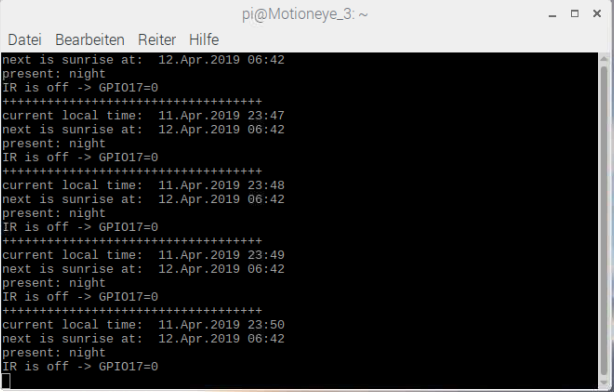

<!DOCTYPE HTML PUBLIC "-//W3C//DTD HTML 4.0 Transitional//EN">
<html>
<head>
	<meta http-equiv="content-type" content="text/html; charset=utf-8"/>
	<title></title>
	<meta name="generator" content="LibreOffice 5.2.7.2 (Linux)"/>
	<meta name="created" content="00:00:00"/>
	<meta name="changed" content="2019-04-12T00:23:04.840160640"/>
	
</head>
<body lang="en-US" dir="ltr">
<table width="100%" cellpadding="0" cellspacing="0" style="page-break-before: always; page-break-after: auto; page-break-inside: avoid">
	<col width="34*">
	<col width="185*">
	<col width="37*">
	<tr valign="top">
		<td width="13%" style="border: none; padding: 0cm">
			
 

			

		</td>
		<td width="72%" style="border: none; padding: 0cm">
			
<u><b>Using
			PiCamera (CSI) with switchable IR filter 
and </b></u><u><b>GPS
			</b></u><u><b>horizon
			controlled activation</b></u>

		</td>
		<td width="14%" style="border: none; padding: 0cm">
			
 

			

		</td>
	</tr>
	<tr valign="top">
		<td width="13%" style="border: none; padding: 0cm">
			
 

			

		</td>
		<td width="72%" style="border: none; padding: 0cm">
			
<b>Motivation: 
</b>MotionEye
			is a great tool for building a surveillance camera. The only
			problem is the missing IR switching functionality but can be
			simply integrated via Python programming by using a switchable
			IR-filter camera over GPIO-port. Additionally an external IR spot
			light can/should be used for night recordings/views. I recommend
			something like this: 
 
 

			

			<table width="100%" cellpadding="4" cellspacing="0">
				<col width="256*">
				<tr>
					<td width="100%" valign="top" style="border: none; padding: 0cm">
						

 

						

					</td>
				</tr>
			</table>
			
 
 

			

			
 
 

			

			

			<b>What
			do we need?:</b>

			

			A
			RaspberryPi CSI camera with switchable IR activation port. I
			recommend this one from Banggood: (It can be used any other one,
			but note the possibility to connect an activation hardware line
			with 3.3V support)

			<table width="100%" cellpadding="4" cellspacing="0">
				<col width="256*">
				<tr>
					<td width="100%" valign="top" style="border: none; padding: 0cm">
						

 

						

					</td>
				</tr>
			</table>
			

			 

			

			

			<b>Hardware
			connection:</b>

			

			Typically
			the CSI cable is delivered with the camera. But the hardware wire
			for the IR activator has to be organiced self. The hardware wire
			to the activation port must be soldered at the camera and
			connected over single pin connector to the Raspis GPIO-port. I‘m
			using port 17(Pin 11). That’s all to make it working…

			<table width="100%" cellpadding="4" cellspacing="0">
				<col width="256*">
				<tr>
					<td width="100%" valign="top" style="border: none; padding: 0cm">
						

 

						

					</td>
				</tr>
			</table>
			

			 

			

			

			<b>Software:</b>

			

			<i>Preparation:</i>

			

			This
			described integration is not working with MotionEyeOS because of
			its limited OS. Better is to install latest Raspbian
			„<a class="western" href="https://www.raspberrypi.org/downloads/raspbian/" name="Raspbian">https://www.raspberrypi.org/downloads/raspbian/</a>“
			and install MotionEye manually. Well described here:
			„<a class="western" href="https://github.com/ccrisan/motioneye/wiki/Install-On-Raspbian" name="Motioneye">https://github.com/ccrisan/motioneye/wiki/Install-On-Raspbian</a>“

			

			I‘ve
			made all
			coding
			with Python over the programming software „Geany“. The Python
			libraries
			need an
			additional
			installation to
			use the sunrise/sunset calculations from “ephem”, that
			can be made very easy with this command in the terminal window: 
 

			

			

			<b>s</b><b>udo
			pip install ephem 
</b> 

			

			

			The
			original program is derived from „
			http://rhodesmill.org/pyephem/“ The changes are:

			

			-
			additional text output for local times (current, next
			sunset/sunrise)

			

			-
			additional decision of current situation (day/night), text output,
			set of the IR pin

			

			-
			cyclically call every 60 seconds

			

			 

			

			

			Take
			the code from this repository: horizont.py and start at your Raspi
			with following command:

			

			 

			

			

			<b>python
			horizont.py</b>

			

			 

			

			

			You
			should see something like this:

		</td>
		<td width="14%" style="border: none; padding: 0cm">
			
 
 

			

		</td>
	</tr>
	<tr valign="top">
		<td width="13%" style="border: none; padding: 0cm">
			
 
 

			

		</td>
		<td width="72%" style="border: none; padding: 0cm">
			

 
 

			

		</td>
		<td width="14%" style="border: none; padding: 0cm">
			
 
 

			

		</td>
	</tr>
	<tr valign="top">
		<td width="13%" style="border: none; padding: 0cm">
			
 
 

			

		</td>
		<td width="72%" style="border-top: none; border-bottom: 1.00pt solid #000000; border-left: none; border-right: none; padding: 0cm">
			
 
 

			

		</td>
		<td width="14%" style="border: none; padding: 0cm">
			
 
 

			

		</td>
	</tr>
</table>

 
 

</body>
</html>
